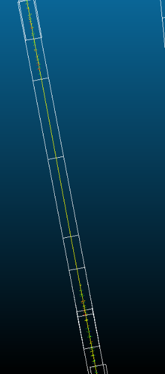
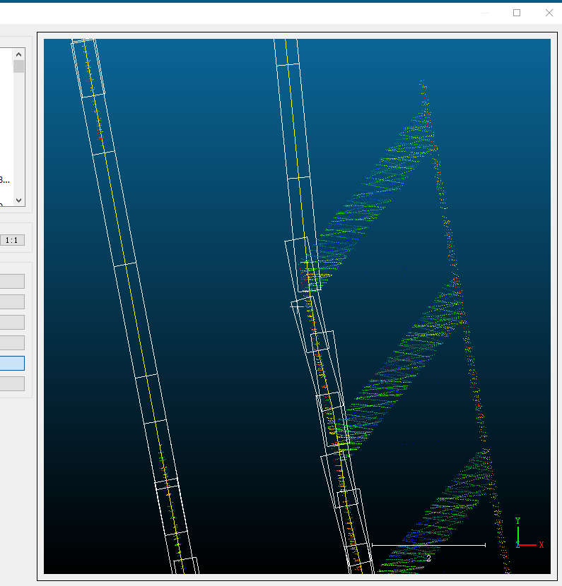
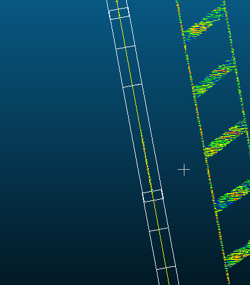
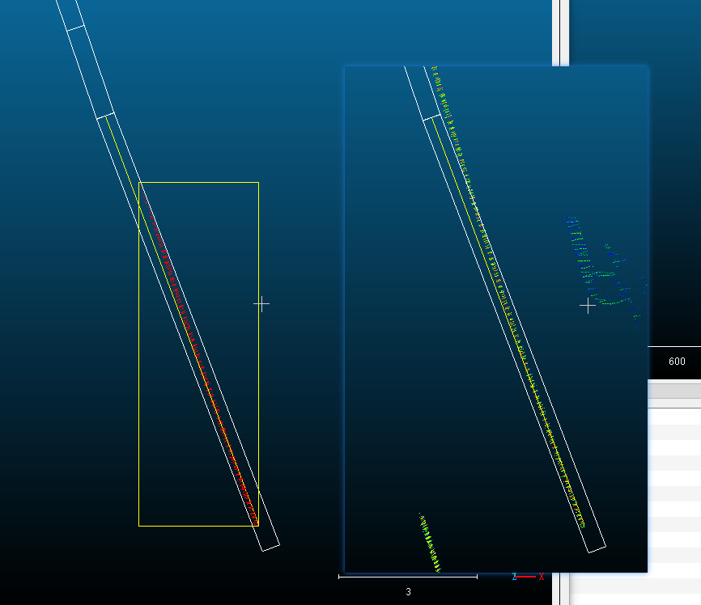
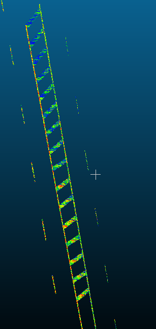
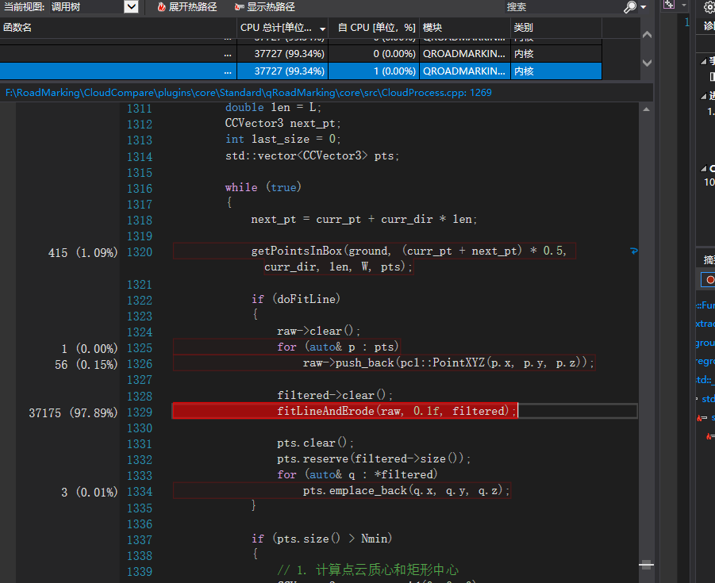
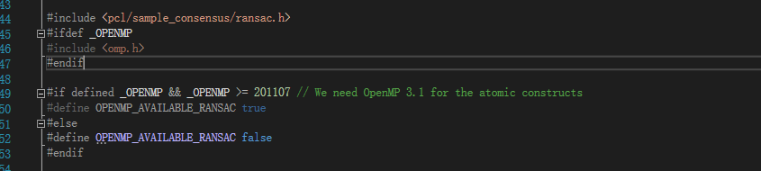
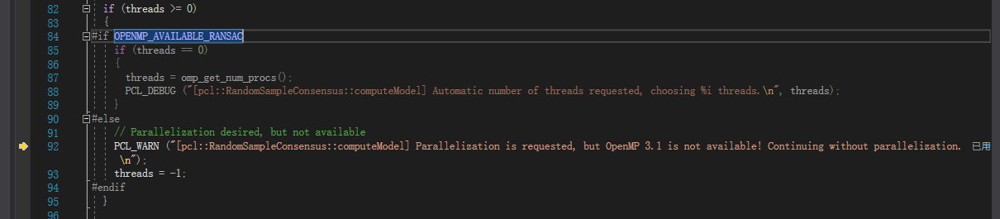

# roadmarking
CloudCompare的路标点云提取插件

SAC：拟合直线，对于拟合的点云，方向完全是两端最远点的方向

PCA:  点云的特征方向，比较接近切线方向

算法改进记录：

1.为了应对弯曲的边线，和跨越断裂，初步决定使用“往前搜索延伸”的形式

2.为了往前延伸，局部使用框选的方式确定方向，具体是，确定矩形的长宽，从辅助的直线的方向和起始点开始，框选局部点云，使用八叉树查找框中点云，使用**PCA（Principal Component Analysis，主成分分析）**确定当前线的局部方向，并调整方向继续延申。

大部分情况适用。

对于一下边界情况处理不好。

比如右边在末端会被局部的点云影响方向。

3.再次改进的想法是，让矩形自动适应线段长度，避免末端影响，为了让他更好适应偏转，每个矩形框选完成后会在平移让点云质心居中。

对间断标线处理的好。

4. 上面的改动分别照成两个问题：延伸不能适应直线的方向偏转，这个是因为矩形末端不是框选点云的末端，以及比较长的点云方向覆盖掉了末端方向。

另一个问题不知道有没有需求：因为点云质心在框居中，如果要提取这种一边的线，会越来越偏。

5.所以再次改进。

使用SAC拟合被框选点云中的直线（其实是一个细小矩形）。

对于末端方向，再次在SAC选中的局部更小的做PAC矩形的延申。

效果大部分情况可以，但是有时候旁边的点更密集会拟合错。而且太耗时。

6. 改进固定起始点拟合直线（拟合方向就行），这样减少了计算量，还更准确一点。（用扇形的自己写的复杂度$O(n*k),k是方向的扇形分区$）和直接用RANSAC也差不了多少（自己写随机选点可能有效，写不来）。

   对于断裂后的新线，要使用RANSAC拟合的直线，先确定起点。

   还有想法就是，对于单次拟合直线，不应该有断裂（这样在转弯的时候应该可以避免直接延伸到另外的道路上）

​	可以加多线程加速。

原来PCL的OpenMP需要201107，而MVSC只有200203，而且在编译OpenMP的库的时候没有开启。

